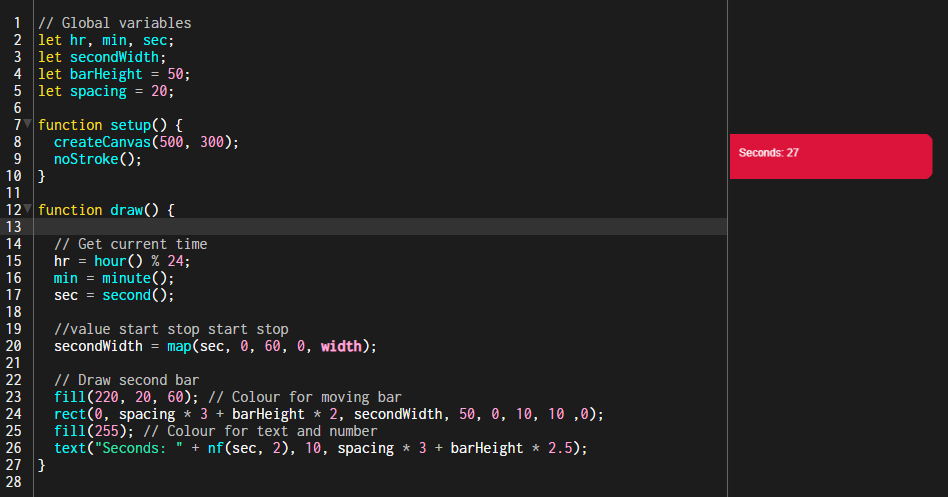
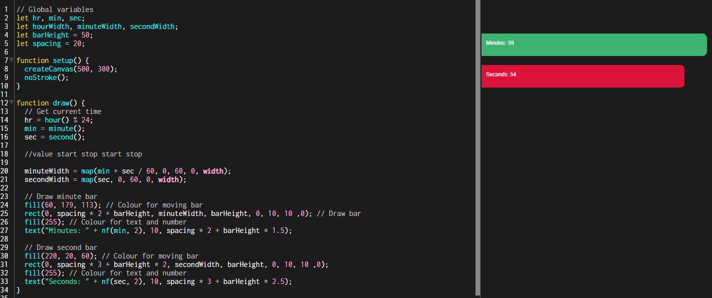
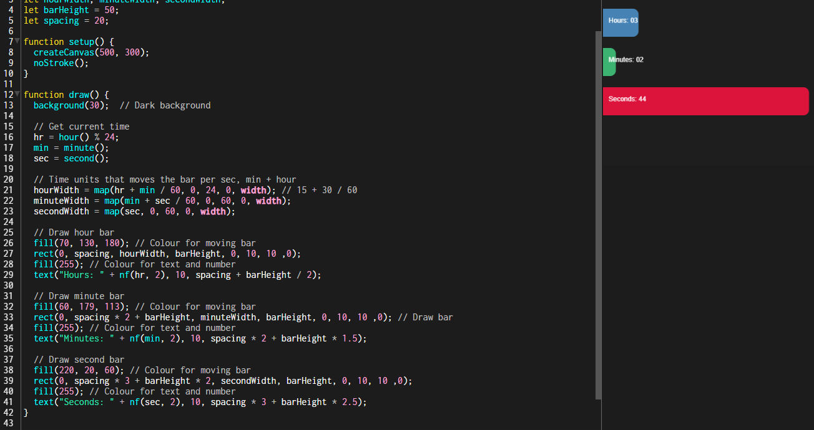

## [Experiment #1 - The BarClock](Experiment1-VisualTimeAlternative/index.html)

For the first experiment of my Creative Coding portfolio, I was tasked with creating an alternative visual way to represent a realtime clock.

Before starting the development of this small project, I first decomposed the problem and thought about how time was divided - into three parts: seconds, minutes and hours. Afterwards I thought to myself, why not just represent time like that? This was a very simple but visual way of representing time in the form of a "bar chart", taking it away from the generic clock ideology that people immediately think of when thinking about "time".

## How was this developed?
The project was started by creating variables to gather the necessary information in order to demonstrate an alternative way of a realtime clock. Afterwards I then began initialising all the variables used within the program and setting them as global variables (my preferred way of programming to eliminate any potential issues).

When thinking about a clock, you imagine all the hands of the clock moving as time slowly goes on - the hand representing seconds continuously going until the end of time. I wanted to do the same thing and have each "bar" within my "clock" show the realtime as it moves forward. However, in order to achieve this I had to set limitations for the width of each bar, for this I used "map()": a function used to convert a number from one range to another. I tested this with "seconds" as it was obviously the most responsive, otherwise I would have to wait each minute/hour to be able to test whether or not it was working. This took some time to figure out the syntax of this function but afterwards it was all clear and I managed to get it working with one of the bars.

Finally, all it took was for me to add the other two bars to represent the minute and hours and adjust the width limitations of the bar representing the "hours" as I wanted to represent a 24-hour clock as it's how I read time. After styling the bars, ensuring the text was readable and aligned in the center of each bar, the project was complete and the "BarClock" was created.

## Screenshots

