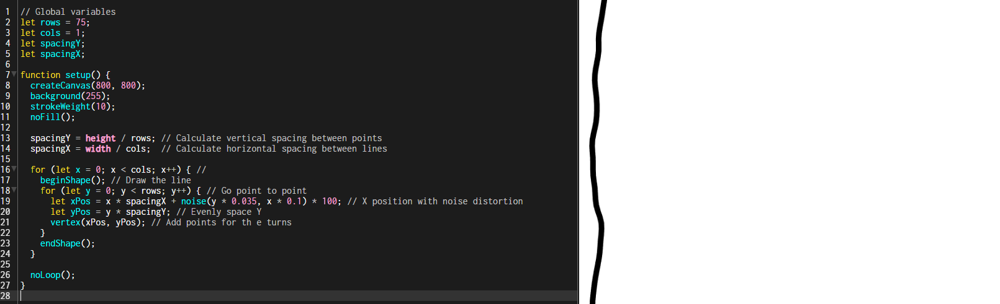
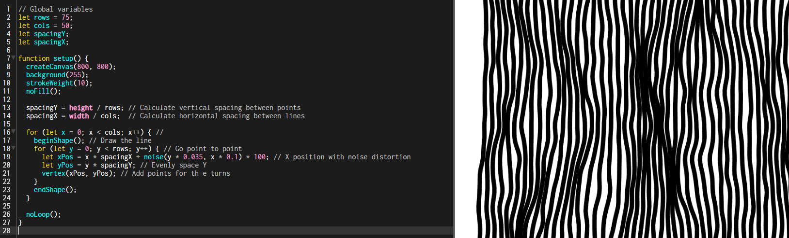
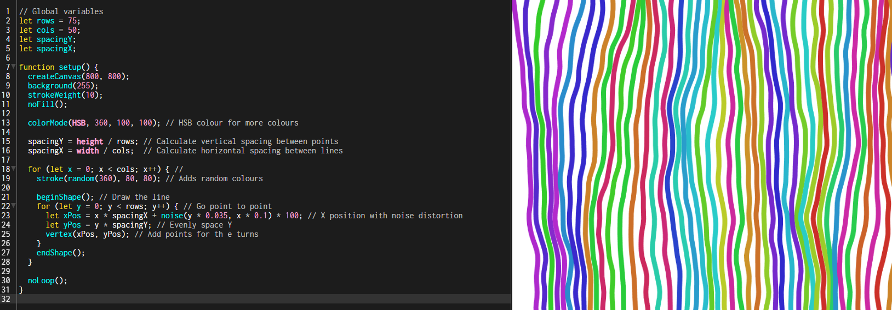

## [Experiment #3 - Generative Pattern](Experiment3-GenerativePattern/index.html)

For the third experiment of my Creative Coding portfolio, I was tasked with creating an autonomous pattern generator that will create a rich visual effect that is different each time it is run. For this piece of work, I took inspiration from "Fidenza", a generative piece of art by a creative coder, Tyler Hobbs, made up of a series of randomly generated lines.

Before starting the development of this small project, I first took a look into Fidenza and found a piece of work I was particularly drawn to, but to this day still have no idea why. I feel like I have a strange sort of connection with its "randomness" and unique behaviour. Below is an image taken from Tyler's website of the piece of work I connected with:

After looking at this, I decided I would attempt to make my own simple version of this piece of work. Although very low fedelity, I feel it worked well and that it's outcome was what I expected and hoped for, eventhough it definitely isn't up to the standards of someone like Tyler Hobbs.

## How was this developed?
I first started the project by creating variables for the columns and rows the lines would appear within. This was required as without them, the lines would appear in too much of a random order which is what I didn't want. I first tested with creating one line before moving onto adding lines into each column and setting the points within each row where the line would slightly shift it's direction. Then further adding random values of colour to make the generated art more appealing and fun. Each line is seperated between "spacing", called `spacingX` and `spacingY` - made up by dividing the rows by the height, and columns by the width.

After testing with one line, I then added a loop to begin drawing each line, or "shape". The `for` loop within the code creates a number of vertical lines based on the value of `cols` and each line is drawn point to point from the top to the very bottom of the canvas. Rather than having plain and boring straight lines, I have adapted the code to generate organic waves within the lines to the position of each point using `noise()` to distort the line. Right at the end of the code, I added the line `noLoop()`, this ensures that the program is just run once and then stops, rather than having the program create multiple lines every second continuously.

## Screenshots

