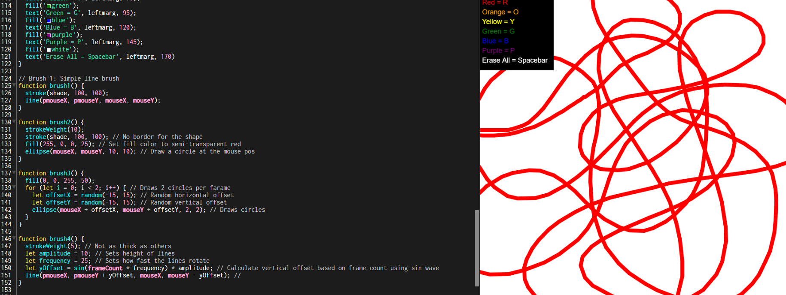
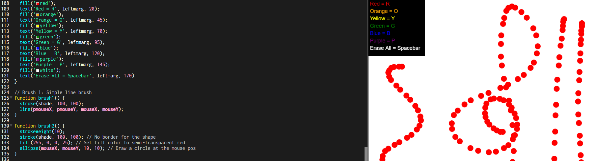
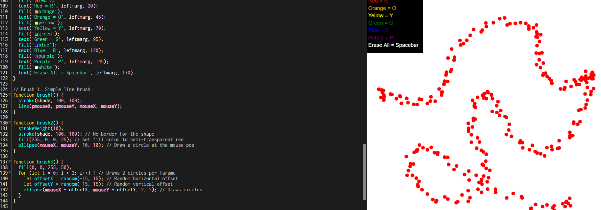
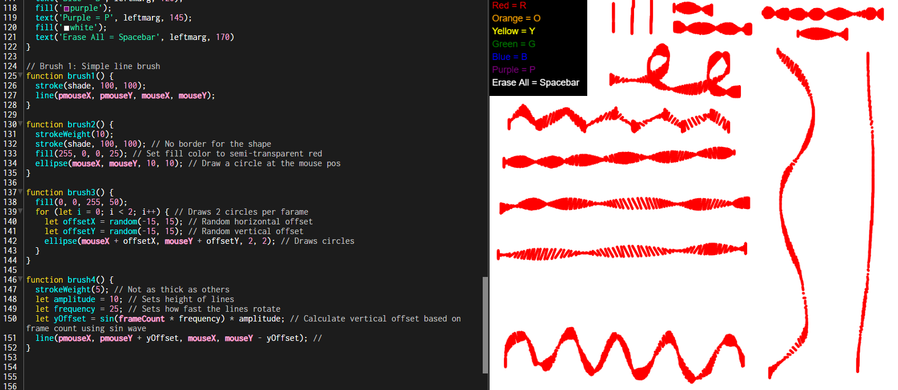
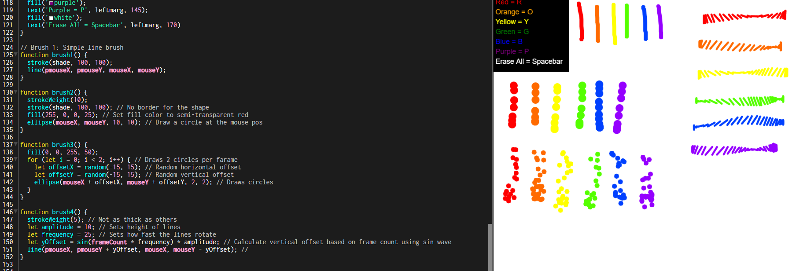

## [Experiment #2 - The Paint Tool](Experiment2-PaintTool/index.html)

For the second experiment of my Creative Coding portfolio, I was tasked with creating a mouse-driven painting tool with four different "brush" tools within it's program.

Before starting the development of this small project, I first took a brief look at a piece of code I made during one of our very first Creative Coding lectures. I used this as a very basic starting point, with already having a menu and a function setup to allow users to change the colours of their brush, as well as a feature to "Erase All" - I'm sure you can imagine what that does.

## How was this developed?
That was a very good starting point, however I needed to change a large amount of the code in order to add the features required within this experiment - four brush tools. It obviously wasn't required to have the separate colours, however I thought it was quite a good addition to keep in that added to the program.

I started on the second brush tool which create circles of "ellipses" based on the position of the mouse - very basic. The third tool however was a bit more complex and created a series of ellipses again, based on the position of the mouse, but this time each with a random offset on both the X and Y axis. The fourth brush technique was definitely more complex and used techniques learnt in class. This brush basically created a line in each frame that didn't roate when moving on the Y axis, but when moving on the X axis the line rotated.

## Screenshots

