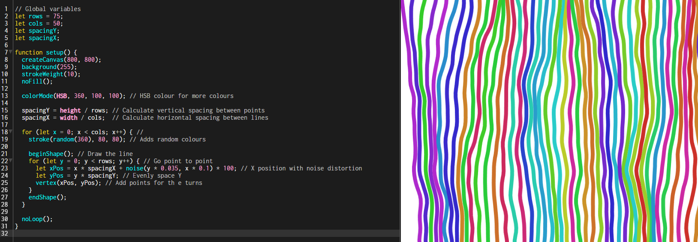

# CC4104-Creative-Coding

Welcome to my submission for the Creative Coding Portfolio. Below are links to each experiment which demonstrate a variety of creative code techniques and variations learnt both during and outside of classes. Before starting this work, we were required to pick three options from a list of experiments, here is what I selected.

### Experiment #1 - The BarClock

Click [here](ExperimentOne.md) to view the experiment.

### Experiment #2 - The Paint Tool

Click [here](ExperimentTwo.md) to view the experiment.

### Experiment #3 - Generative Pattern

Click [here](ExperimentThree.md) to view the experiment.
